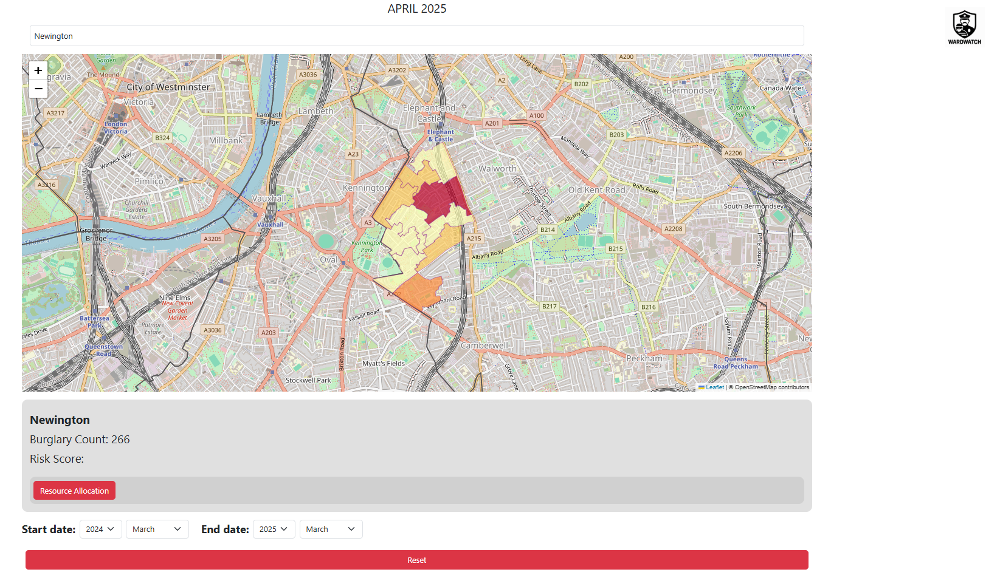
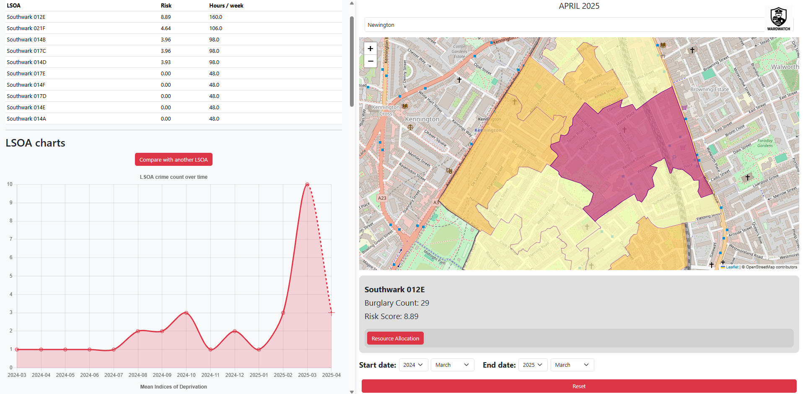

# WardWatch

WardWatch is an interactive predictive modelling dashboard that forecasts household burglary risk across London and translates those forecasts into weekly police patrol hour allocations.

## Overview

WardWatch forecasts household burglary risk for every Lower Layer Super Output Area (LSOA) in London and turns those forecasts into monthly patrol allocation plans. It is built entirely on open source data and gives a police management audience an interactive map of relative risk alongside the economic and demographic context relevant to resource allocation. An ALGOCARE-based ethical review of the design, covering advisory role, granularity, ownership, accuracy and explainability, is included below along with the model's performance results.

This was built as a course project for TU Eindhoven course, addressing real world crime and security problems with data science.

## Contributors
- Martin Rashkov
- Thom Coolen
- José Maria Ramos Gil Dias Batista
- Octavian Cravcenco
- Stanimir Dimitrov
- Sep Koks

## Features

The dashboard displays an interactive map of London that drills down from borough level to ward level to LSOA level, colouring LSOAs by relative burglary risk. Selecting an LSOA opens a resource panel that shows its historical and predicted burglary count together with the risk score and the suggested weekly patrol hours. A search box allows jumping directly to a named borough, ward or LSOA, and a reset control returns the map to its default view. An information popup explains how the risk score and hour allocation are calculated. The allocation itself splits each ward's 800 weekly patrol hours so that 60 percent (480 hours) is shared equally across all LSOAs in the ward as baseline coverage, and the remaining 40 percent (320 hours) is distributed in proportion to each LSOA's relative risk score, with the result rounded to two hour patrol shifts.

## Results

The XGBoost model was benchmarked against a per-LSOA linear regression baseline and an LSTM model that used hand-engineered spatial features (neighbouring LSOA counts and average neighbour crime).

| Model             | MAE  | RMSE |
|-------------------|------|------|
| XGBoost           | 0.29 | 0.64 |
| LSTM              | 0.78 | 1.05 |
| Linear Regression | 0.90 | 1.25 |

XGBoost cuts error roughly in half compared to the next-best model. On average its monthly burglary-count prediction is off by under 0.3, though the larger RMSE relative to the MAE indicates a small number of outlier LSOAs where the model under-predicts by several burglaries. This happens almost exclusively in the small subset of high-crime LSOAs, while the majority (burglary counts of 0 to 3, around 97% of the data) are predicted with high accuracy.

Feature importance was assessed with three complementary methods: gain, permutation importance, and SHAP. This was done to avoid relying on a single, potentially misleading metric. Across all three, recency of the last burglary and the 3-month rolling average of crime were consistently the strongest predictors, followed by 1-month lag count, neighbouring LSOA crime context, and socioeconomic indicators such as education and environment scores.

## Ethical Considerations

The design was evaluated against the [ALGOCARE](https://algorithmwatch.org) framework for algorithmic decision-making in policing, focusing on five criteria:

- **Advisory:** The tool is advisory only. It surfaces a risk score and a suggested hour allocation, but a human officer always retains control over final deployment decisions, with local knowledge from officers on the ground expected to complement, not be replaced by, the model's output.
- **Granularity:** Predictions are made at LSOA level, the finest geography for which both crime and socioeconomic data are reliably available. This improves model precision but raises privacy considerations; the trade-off was judged acceptable since the underlying LSOA crime data is anonymised.
- **Ownership:** The model and underlying data are built entirely from open-source sources (ONS, Census, police.uk), with no external licensing or access restrictions that could limit the police force's ability to audit, amend, or evaluate the tool.
- **Accuracy:** False positives (over-policing low-risk areas) and false negatives (under-policing high-risk areas) are acknowledged as unavoidable. The 60/40 baseline-to-risk-based hour split is designed to bound this risk. All areas retain a minimum coverage floor regardless of model error.
- **Explainable:** XGBoost was chosen partly for its interpretability. Feature importance (gain, permutation, SHAP) is exposed to let a force's data science staff explain and justify individual predictions and monitor for emerging bias in the model over time.

Sensitive attributes such as ethnicity were deliberately excluded from the feature set to reduce the risk of biased or discriminatory outcomes.

## Data Source

The burglary crime data covers December 2010 through February 2025 and comes from the police.uk open data archive, filtered to the Metropolitan Police force and aggregated to monthly counts per LSOA. Societal wellbeing and Index of Multiple Deprivation data for 2010, 2015 and 2019 comes from opendatacommunities.org. Economic activity data for 2011 and 2021 covers employment and unemployment status per LSOA. Age distribution data is derived from 2021 ONS population estimates, broken down by LSOA, age band and gender. LSOA boundary shapefiles and the London ward boundary shapefile are used to build the interactive map and to compute neighbouring LSOA relationships.

The ONS and Ordnance Survey products above are supplied under the Open Government Licence and the Ordnance Survey OpenData Licence, both of which permit free reuse, including commercial reuse, provided the following attribution is included wherever the data is reproduced.

To regenerate the processed datasets yourself, download the raw sources described above and place them in the `raw data` folder following the file names configured in `config.py`, then run the corresponding loader functions in `data_loader.py`, for example `data_loader.load_crime_data()`, `data_loader.load_societal_wellbeing_data()`, `data_loader.load_economic_activity_data()` and `data_loader.load_final_data_2022()`. Each loader will compute and cache the processed CSV automatically if it does not already exist locally under `data/`.

## Technology

The data pipeline and predictive model are written in Python, using pandas, geopandas, scikit-learn, matplotlib, seaborn, contextily and openpyxl, as listed in `requirements.txt`. The predictive model itself is an XGBoost regressor, trained and evaluated in `Models/XGboost_+_Explainability_SHAP.ipynb`, alongside baseline linear regression and LSTM notebooks used during model selection. The dashboard front end is static HTML, CSS and JavaScript, using Leaflet for the map and Bootstrap 5 for layout.

## Project Structure

The root of the repository contains `config.py` for shared constants and file name mappings, `data_loader.py` for the full data loading and preprocessing pipeline, `EDA.py` and `DC_2_EDA.ipynb` for exploratory analysis, and `main.py` as a general purpose entry point for pipeline checks. The `data` folder holds the processed and combined datasets described above. The `raw data` folder holds the raw downloads organised into boundaries, crime, force boundaries, other and societal wellbeing subfolders. The `Models` folder contains the notebooks used to develop and evaluate the linear regression baseline, the LSTM model, and the final XGBoost model with SHAP based explainability. The `dashboard` folder contains the static front end: `index.html`, `main.css`, `main-map.js` and `charts.js`, together with `main.py`, which is a standalone build script that generates the borough, ward and LSOA GeoJSON files used by the map from the London ward and LSOA boundary shapefiles. The `dashboard/webdata` folder holds those generated GeoJSON files along with the precomputed monthly burglary predictions consumed by the dashboard. The `images` folder holds the project logo and the exploratory data analysis charts referenced in the report.

## Installation and How to Run

Clone the repository and create a virtual Python environment. Install the Python dependencies with `pip install -r requirements.txt`. Install the single JavaScript dependency with `npm install`. Download the raw datasets described above into `raw data`, then run the loader functions in `data_loader.py` to produce the processed files under `data`. To rebuild the dashboard's GeoJSON layers from the boundary shapefiles, run `dashboard/main.py` from inside the `dashboard` folder. Because the dashboard loads its GeoJSON layers with JavaScript `fetch` calls, `index.html` needs to be served over HTTP rather than opened directly as a local file. From inside the `dashboard` folder, running a simple local server such as `python -m http.server` and then opening the reported address in a browser will load the dashboard correctly.

## Limitations and Future Work

The underlying crime data is monthly, which limits predictions to monthly resolution rather than the daily or hourly resolution that would better suit operational patrol planning. The dashboard currently reads from a static, precomputed prediction file rather than an API or live database, so new monthly predictions have to be generated and copied into place manually rather than fetched on demand. The tool does not currently generate recommendations for special operations such as localized surges or specific events, since that would require data at a finer granularity than is currently available. Sensitive features such as ethnicity were deliberately excluded from the model to reduce the risk of biased decision making.

## License

The code in this repository is released under the [MIT License](LICENSE). This license covers the code only. The underlying datasets described above are separately licensed under the Open Government Licence and the Ordnance Survey OpenData Licence and are not redistributed in this repository.